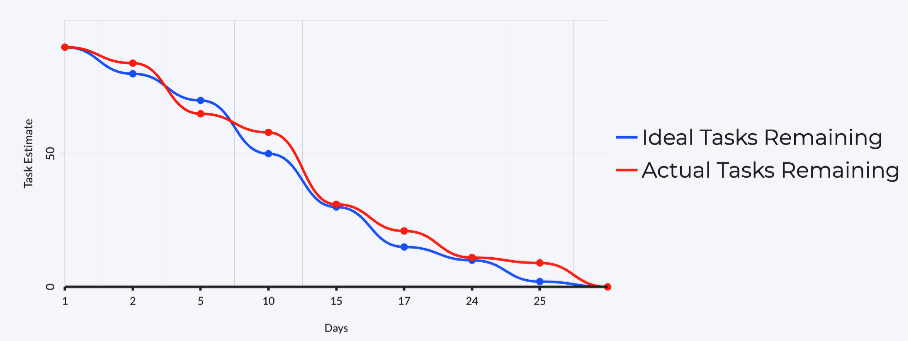

# Burndown Chart

Using the [filter view list on Jira](https://uwe-desd.atlassian.net/jira/software/projects/SCRUM/list?filter=Sprint%20in%20openSprints()&sortBy=updated&direction=ASC&groupBy=customfield_10020)

See image below for the view:

Each sprint should be grouped as shown. 
Filtered with earlier updated 
(when something was changed in a sprint issue like being completed).

For example SCRUM-91 was created on the 10th, so all sprints 
on the burndown chart happen from that or the sprint start date. Which ever comes last.

So the burndown chart has to be made from the 10th. 

We know we have 90 story points to complete from below:

We use https://my.visme.co/ for the burndown chart as it's free and easy to use.

The 90 story points would be placed as B for both Ideal and Actual.

Then the deadlines for each sprint would be deducting the story points for each Ideal day.

Each day is whenever something is calculated as Done. 

For example, if SCRUM-93 was completed on the 12th, then the burndown chart day would be 2. 12-10=2.

The complete one should look something like:

