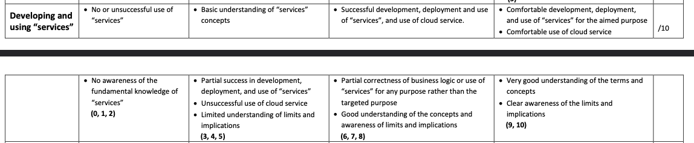
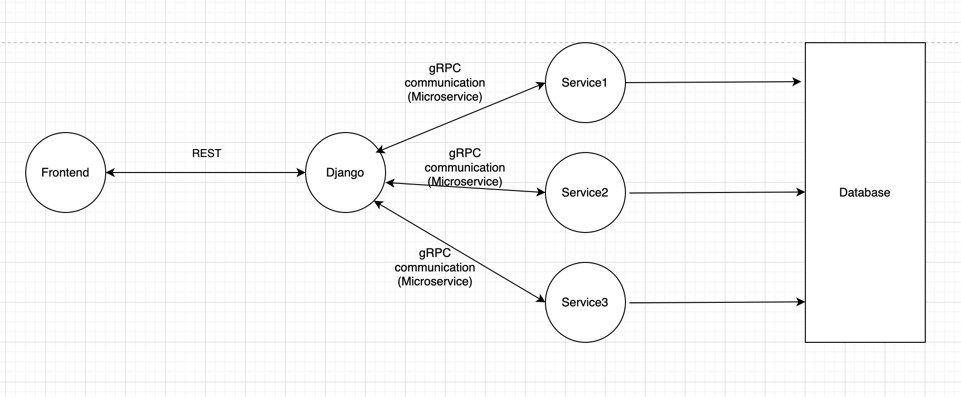
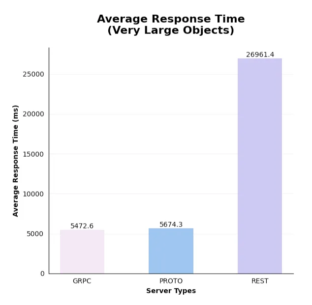

# Microservices

We use microservices due to the requirements of the module.

> You are expected to design and build your software system using
Python Django framework following the
MVC design patterns, (MVT of Django implementation) using a Relational database of your choice (e.g.
MySQL, PostgreSQL etc.) for the backend. The system-to-be should be developed as a prototype of an
enterprise software, which requires to be a distributed system, where the pieces (components) are
required to be distributedly deployed on a number of containers (2 containers minimum, 3 or 4 ideally)
created and run via docker.

## Structure

- [core](../../backend/core): The main Django application, contains the main views, and settings. Handles HTTP.
- [chat](../../backend/chat): The chat service, handles chat functionality.

Similar to the below structure:

## GRPC

We use GRPC for communication between the services for performance over HTTP.

See performance below: (lower is better):

> [gRPC’s performance is most resilient, outperforming HTTP/protobufs by around 25–30%, and REST by more than 9x for large payload sizes](https://medium.com/@i.gorton/scaling-up-rest-versus-grpc-benchmark-tests-551f73ed88d4)

See [gRPC vs REST: Understanding gRPC, OpenAPI and REST and when to use them in API design](https://cloud.google.com/blog/products/api-management/understanding-grpc-openapi-and-rest-and-when-to-use-them)

### Proto definitions

Use the documentation for support: https://protobuf.dev/programming-guides/proto3/

