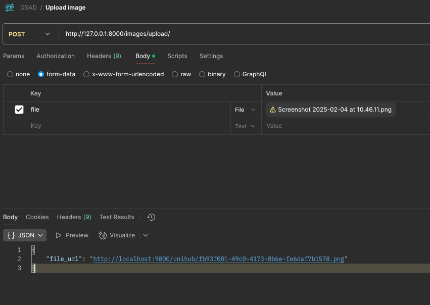

# Uploading files/images

Caching is based off Boto3 that utilises S3. Instead, we use Minio, which is an open-source alternative to S3.
This allows it to run in a Docker container, which is useful for local development without the requirements
to share AWS credentials.

## Example usage

Ensure docker is installed on your machine. To test the file/image uploading in a Django project, follow the steps below:

- Go into an app (e.g. `core`)
- Add the following code to a view:

```python
from django.http import JsonResponse
from django.views.decorators.csrf import csrf_exempt

from backend import StorageClient


@csrf_exempt
def upload_file_view(request):
    if request.method != "POST":
        return JsonResponse({"error": "Invalid request method"}, status=400)

    if not request.FILES.get("file"):
        return JsonResponse({"error": "No file uploaded"}, status=400)

    file = request.FILES["file"]
    minio_client = StorageClient()
    # Check if it's an image etc, standard security stuff
    file_url = minio_client.compress_and_upload_image(file)
    return JsonResponse({"file_url": file_url})
```

- Add the following to your `urls.py`:

Do note: some of this code may already be present in the `urls.py` file
```python
from django.urls import path
from .views import upload_file_view

urlpatterns = [
    path('upload/', upload_file_view),
]
```

- Add the following code to the `urls.py` located in `unihub_project`:

Do note: some of this code may already be present in the `urls.py` file, so you may need to add the `include` import and the `path` line.
And just the `path` line if `urlpatterns` is already present. Replace `imagehandling` with the name of the app you're using such as `core`.
```python
from django.urls import path, include

urlpatterns = [
    path('images/', include("imagehandling.urls")),
]
```

- Run `docker-compose up --build`.
- Use a tool like Postman to send a POST request to `http://localhost:8000/upload/` with a file in the body.



- The response will contain the URL of the uploaded file.

## Uploading images

Utilise `compress_and_upload_image` function from `common/files/client.py` to upload images. This function compresses the image and uploads it to Minio.
You may change the default quality of the image by changing the `quality` parameter in the function. The default is 85, the higher the number, the better the quality.

## Uploading files

Utilise `upload_file` function for uploading standard files like pdfs. This function has no added compression, although Minio may compress it on its own.

## Accessing uploaded files

There is no function to download/get files from Minio. The correct implementation is to use the URL returned from the upload function and store it in the database.
Then you may utilise the URL to download the file.

## Deleting files

Utilise `delete_file` function to delete files from Minio. DO NOT PASS THE URL, instead pass the filename that was returned from the upload function.

For example if the URL was `http://localhost:9000/unihub/1234567890.jpg`, the filename would be `1234567890.jpg`.

Optionally utilise `replace_file` function to replace files. This function will delete the old file and upload the new one. 
Although, this is the same as calling `delete_file` and then `upload_file`.

For more information, see the [Pull Request](https://github.com/athyk/distributed-and-enterprise/pull/1)